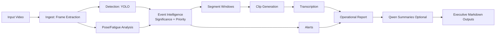

# Railway Safety Video Intelligence

## Executive Summary

Railway Safety Video Intelligence is an enterprise-oriented, offline video analytics solution for locopilot and in-cab behavior monitoring. It transforms raw surveillance footage into operationally actionable safety evidence, including anomaly-focused clips, fatigue analytics, alerts, transcripts, and executive-readable summaries.

The platform is designed to support safety operations, audit readiness, and incident review workflows with minimal manual video scanning.

## Business Outcomes

- Reduce manual review effort by converting long-duration footage into event-centric clips.
- Improve response speed to potential driver-risk behaviors such as fatigue and distraction.
- Standardize reporting outputs for safety, operations, and compliance stakeholders.
- Maintain deployment flexibility through offline-first execution and optional LLM summarization.

## Primary Use Cases

- Driver vigilance monitoring in locomotives.
- Post-incident reconstruction and timeline analysis.
- Routine safety audits for prohibited or unsafe in-cab behavior.
- Compliance evidence packaging for supervisory review.

## Core Product Capabilities

- Video ingestion and frame extraction using FFmpeg.
- Object/event detection using YOLO.
- Pose-based fatigue analytics using OpenCV signals.
- Event significance filtering for anomaly-first clipping.
- High-priority event isolation for severe fatigue events (for example microsleep/asleep).
- Automatic clip transcription.
- Alert generation with segment-level risk context.
- Human-readable report generation.
- Optional Qwen summaries in Markdown (clip-level and whole-video).

## Functional Workflow

1. Load runtime settings from `.env`.
2. Extract frames from source video at configured sampling frequency.
3. Run object detection and confidence filtering.
4. Run pose/fatigue analytics (slouch, head-nod, yawn, microsleep).
5. Build significant event windows from detection and fatigue signals.
6. Preserve each event occurrence as a distinct clipping unit.
7. Isolate configured high-priority events from overlap merges.
8. Generate clips, transcripts, alerts, and final reports.
9. Produce optional Qwen narrative summaries.

## Reference Architecture

### System Components

- Ingestion Layer: frame extraction and media normalization.
- Perception Layer: object detection plus pose/fatigue analytics.
- Event Intelligence Layer: significance filtering, event scoring, and segment construction.
- Evidence Layer: clip generation, transcription, and risk alert payloads.
- Reporting Layer: operational report and optional executive LLM summaries.

### Data Flow Diagram



### Processing Boundaries

- Mandatory Offline Path: ingest, detect, fatigue, segmentation, clipping, alerts, report.
- Optional Remote Path: Qwen summarization only.
- Artifact Interface: JSON/Markdown outputs for downstream enterprise systems.

## Event Intelligence Model

The segmentation system prioritizes behaviors relevant to train-driving safety:

- Distraction events: phone/laptop and configured high-risk objects.
- Fatigue events: `fatigue_microsleep`, `fatigue_asleep`, `fatigue_slouch`, `fatigue_head_nod`, `fatigue_yawn`.
- Priority model: high-priority labels are retained as separate clips even when temporally adjacent to other events.

This supports both operational screening and detailed incident triage.

## Deliverables And Data Contracts

All outputs are generated under `output/`:

- `detections.json`: raw detection records.
- `pose_fatigue.json`: per-frame posture/fatigue indicators.
- `segments.json`: event windows with start/end frames, time, label, and severity metadata.
- `clips/`: one clip per event occurrence window.
- `alerts.json`: global and segment-level alerts with risk indicators.
- `transcripts/transcripts_index.json`: transcript manifest for produced clips.
- `report.txt`: consolidated operational report.
- `qwen/clip_summaries.md`: clip-level Markdown summaries.
- `qwen/whole_video_summary.md`: executive narrative summary.
- `qwen/qwen_summary_manifest.json`: LLM run metadata.

## Enterprise Configuration Surface

Configuration is managed through `.env` and supports controlled deployment tuning.

### Model And Runtime

- `YOLO_MODEL_PATH`
- `WHISPER_MODEL_PATH`
- `QWEN_API_BASE_URL`
- `QWEN_MODEL`
- `QWEN_MODEL_CANDIDATES`

### Detection And Segmentation Controls

- `FRAME_RATE`
- `DETECTION_CONF_THRESHOLD`
- `SEGMENT_GAP`
- `MIN_SEGMENT_FRAMES`
- `MAX_SEGMENT_FRAMES`
- `EVENT_LABELS`
- `MIN_EVENT_SCORE`
- `MIN_EVENT_SEGMENT_FRAMES`
- `EVENT_PADDING_FRAMES`
- `EVENT_OCCURRENCE_BY_LABEL`
- `EVENT_MERGE_PADDED_OVERLAPS`

### Significance And Priority Controls

- `CLIP_SIGNIFICANT_EVENTS_ONLY`
- `SIGNIFICANT_EVENT_LABELS`
- `REPORT_SIGNIFICANT_EVENTS_ONLY`
- `USE_POSE_FOR_SIGNIFICANT_EVENTS`
- `SIGNIFICANT_FATIGUE_FLAGS`
- `HIGH_PRIORITY_EVENT_LABELS`

### Alerting Controls

- `FATIGUE_ALERT_FRAME_RATIO`
- `MAX_MICROSLEEP_EVENTS`
- `MAX_YAWN_EVENTS`
- `HIGH_RISK_LABELS`

## Deployment Model

- Execution mode: local/offline pipeline.
- Runtime dependency: Python + FFmpeg.
- External dependency: optional for Qwen summaries only.
- Integration model: file-based artifacts suitable for downstream systems and dashboards.

## KPI And ROI Framework

### Recommended Success Metrics

- Review Time Reduction: median manual review minutes before vs after event-based clipping.
- Event Precision: percentage of produced clips judged safety-relevant by reviewers.
- High-Risk Recall: percentage of known severe events captured (for labeled validation sets).
- Alert Actionability: percentage of alerts that result in follow-up action.
- Triage Latency: time from run completion to first investigator decision.

### Baseline And Measurement Plan

- Establish baseline from current manual workflow for at least 2 to 4 weeks.
- Measure per-route and per-shift to avoid aggregation bias.
- Track both macro outcomes (time saved) and quality outcomes (missed critical events).
- Report monthly deltas and confidence intervals for governance reviews.

### Example ROI Model

Use this template:

$$
MonthlySavings = (H_{manual} - H_{assisted}) \times C_{reviewer}
$$

Where:

- $H_{manual}$ is monthly manual review hours.
- $H_{assisted}$ is monthly review hours with this system.
- $C_{reviewer}$ is loaded hourly review cost.

And:

$$
NetROI = \frac{MonthlySavings - OperatingCost}{OperatingCost}
$$

### Operational KPI Targets (Suggested)

- Review Time Reduction: 40% to 70%.
- Event Precision: 75%+.
- High-Risk Recall: 90%+ on validated datasets.
- Triage Latency: under 30 minutes for standard shift reviews.

## Security And Governance Notes

- Keep all credentials and API keys in local `.env` files.
- Do not commit secrets to source control.
- For regulated environments, disable remote summary generation by omitting Qwen endpoint credentials.

## Release Readiness And Support Model

### Release Gates

- Functional Gate: end-to-end pipeline run succeeds on representative sample videos.
- Quality Gate: clip precision and fatigue-event capture meet agreed KPI thresholds.
- Stability Gate: regression tests pass for segmentation, clipping, reporting, and transcription.
- Security Gate: no secrets in repository and environment settings reviewed.
- Documentation Gate: README, configuration matrix, and runbook updated.

### Versioning And Change Control

- Use semantic versioning for release tags.
- Maintain a change log with behavior-impact notes (especially event rules and thresholds).
- Require reviewer sign-off for modifications to significance/priority controls.

### Known Limitations

- Performance and accuracy depend on camera angle, lighting, and frame quality.
- Extremely dense detections may still require threshold tuning for clip compactness.
- Fatigue signals are heuristic and should be treated as operational indicators, not medical diagnosis.

### Enterprise Support Model (Suggested)

- L1 Operations Support: run failures, artifact generation checks, reruns.
- L2 ML/Analytics Support: threshold tuning, event precision tuning, false-positive analysis.
- L3 Engineering Support: pipeline defects, model integration, architecture changes.

### Incident Severity Matrix (Suggested)

- Sev-1: critical pipeline outage on production workflow, no report deliverable.
- Sev-2: degraded outputs with incomplete clips/alerts.
- Sev-3: cosmetic or non-blocking report/summarization issues.

### Support SLAs (Suggested)

- Sev-1 response: within 1 hour, workaround or rollback within 4 hours.
- Sev-2 response: within 4 business hours, fix plan within 1 business day.
- Sev-3 response: within 2 business days, patch in next planned release cycle.

## Installation And Execution

### Prerequisites

- Python 3.8+
- FFmpeg available on PATH

### Install

```powershell
python -m venv .venv
.\.venv\Scripts\activate
pip install -r requirements.txt
```

### Run

```powershell
python main.py input_video.mp4 output
```

In managed Windows environments, using `.venv/Scripts/python.exe` directly is recommended to avoid interpreter mismatch.

## Recommended Operating Defaults

The following settings are tuned for concise, review-ready outputs:

- `DETECTION_CONF_THRESHOLD=0.45`
- `SEGMENT_GAP=2`
- `MIN_SEGMENT_FRAMES=3`
- `EVENT_PADDING_FRAMES=1`
- `EVENT_OCCURRENCE_BY_LABEL=1`
- `EVENT_MERGE_PADDED_OVERLAPS=0`
- `CLIP_SIGNIFICANT_EVENTS_ONLY=1`
- `SIGNIFICANT_EVENT_LABELS=cell phone,phone,laptop`
- `USE_POSE_FOR_SIGNIFICANT_EVENTS=1`
- `SIGNIFICANT_FATIGUE_FLAGS=microsleep,asleep,slouch,head_nod,yawn`
- `HIGH_PRIORITY_EVENT_LABELS=fatigue_microsleep,fatigue_asleep`

## Repository Structure

```text
main.py
pipelines/
  alerts.py
  clipper.py
  detect.py
  ingest.py
  pose_fatigue.py
  report.py
  segmenter.py
  transcriber.py
  qwen_summary.py
output/
tests/
```

## License

MIT
